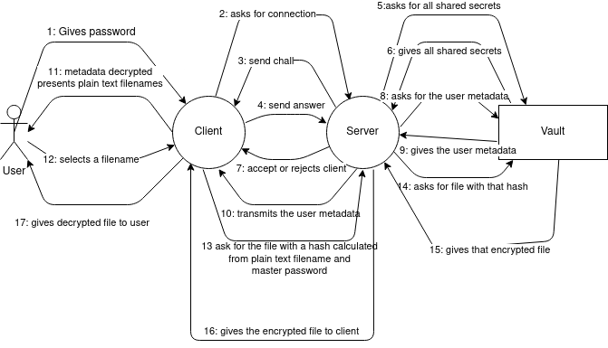

# Report Lab 2 CAA Encrypted Vault

## Author

```
Alban Favre
```

### Design

Important: At no time and no circumstances should the server ever be aware of:

- Any plain text filenames
- Any plain text files
- The master password
- The master key
- Any file keys

#### Structure

##### There are 4 entities:

- The user which posses the master password
- the client, an app that will do all the work with the master password
- the server, the app that makes the link between the vault and the client
- the vault, The database that stores all metadata and encrypted file.

A complex image representing those 4 entities can be found at the end of this document.

##### There are 2 type of things that are stored:

- The user metadata, one per user, it contains:
  - the list of all encrypted filenames
  - the salt and nonce used to decrypt the list of all encrypted filenames
  - the shared secret. It is the only way to know to which user a metadata is linked to
- Encrypted file, 0 to filled db per user, it contains:
  - a unique hash, that is used to identify the encrypted file
  - the salt and nonce used to decrypt this particular file
  - the encrypted data

```rust
#[derive(Serialize, Deserialize, Debug)]
pub struct EncryptedFile {
    pub pt_filename_hash: String,
    pub encrypted_data: String, from the given salt
    pub file_salt: String,
    pub file_nonce: String,
}

#[derive(Serialize, Deserialize, Debug)]
pub struct MetaData {
    pub encrypted_filenames: Vec<String>,from the derived key from the given salt
    pub user_salt: String,
    pub user_nonce: String, 
    pub shared_secret: String,
}
```

#### Fake Database

To simulate the database, I use two files: `coolfilevault.txt` and `coolmetadatavault.txt` . Those two files are supposed to represent two table in the database. I'd like to precise that the method `Vault::create_default_db()` and the tests in `vault.rs` are extremely ugly. These were made in the sole purpose to quickly understand and test my cryptographic designs. They are therefore filled with copy pasted code and hard codded value.

If the database is not initialized, the connection wont work, as there are no user's metadata.

#### Fake connection

There is no communication, 2 objects, a client and a server will simulate the communications.

#### Challenge-response authentication

As the server should never see the master password. I could not give it during authentication.

I went with a shared secret. This shared secret could exist from an ulterior connexion, but I did not do that.  I decided that the user should be able to connect from a new computer/terminal, this shared secret is therefore only the hash of the master password. And if the shared secret was a second password, that would not respect the only one password to enter rule.

It is hashed with `sodiumoxyde::crypto:hash:sha512`. This is extremely weak, the server could just brute force the hash until it finds the master password. It would be easy to strengthen, at the account creation, the client and the server could decide for a shared secret that wouldn't be linked to the master password. However such a solution makes a connection from a different client impossible. 2FA might be a solution, but I did not look into it enough. My password hash is not salted either, as I would have to store the hash in the vault, where the server can find it.

The good news is that the shared secret doesn't travel. The server generate a nonce from 256 random bytes (`sodiumoxide::randombytes::randombytes`). That is sent to the client. The answer to the challenge is the hash of the shared secret and the nonce (`sodiumoxyde::crypto:hash:sha512`).

The server has to compute all possible answers from all the user**s**' shared secret to find which user tries to connect. Once it has confirmed the response by identifying the user, it will send this particular user it's metadata.

I put 256 random bytes to mitigate the birthday paradox, however on day or another a new shared password should be derived. I did not implement this, but we could imagine starting to use hashes from specific derivation from the master password. 

#### Reading the filename list

Now that the client has its metadata. The client can decrypt the filename. It will first need to derive the symmetric key from the master password. To do that I use `sodiumoxide::crypto::pwhash::derive_key()` I  don't know which particular primitive is used as default as it's not specified, but it's either `argon2i13`, `argon2id13` or `scryptsalsa208sha256`. To derive the key a salt is necessary, that salt is also stored in this particular user's metada.

Once in possession of the master key, the client needs to decrypt the filenames, to do that I used `sodiumoxide::crypto::secretbox::xsalsa20poly1305`. A nonce is needed, it is also stored in this particular user's metada.

Once this is done the user can read the filename in plain text. And choose which file they'd like to read / download.

#### Choosing a file

The files in the vault are uniquely defined with a hash of the master password and the file's plain text name. Once a file is selected by the user, the client will hash the master password with the plain text filename (`sodiumoxyde::crypto:hash:sha512`). This hash will be sent to the server which will find the corresponding encrypted file. Once in possession of the file, it will give it to the client.

#### Decrypting a File

It's the same as for the metadata. The encrypted files contains the salt with which the client derives the master password to get the file key ( `sodiumoxide::crypto::pwhash::derive_key()` with the same uncertain default primitive). That file key is then used with the received nonce to decrypt the encrypted data, that will be shown to the user.

#### Bonus

##### Multiple users

Even if my default database doesn't have more than 1 user, my code has been thought with multiple users in mind, where the data in the vault cannot be linked to the user without the user's master password. However this probably slows my application a whole lot, as the server needs to check **all** possible response from all users shared secret during the challenge-response part. Juts to correctly identify the metadata that needs to be sent.

##### 2FA

This would be easy to implement with google authenticator. The problem is that it technically is a second password the user has to enter. But it would seriously strengthen my authentication process. Sadly I did not have time to implement it.

#### Limits

The number of unique nonce/salt will be competed one day. We should consider more keys derivation in that case.

#### Image

